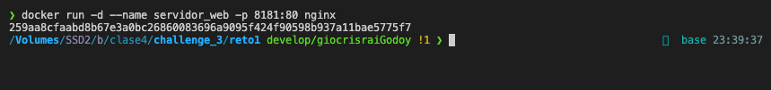
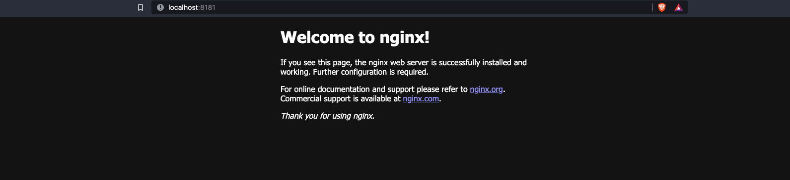
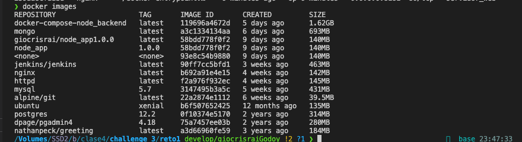
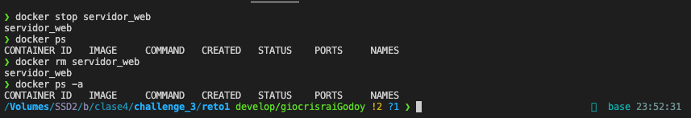

# Solución del reto 1

1. Pantalazo donde  se vea la craación del contenedor y podamos comprobar que el contenedor está funcionando

        $ docker run -d --name servidor_web -p 8181:80 nginx

2. Pantallazo donde se vea el acceso al servidor web utilizando un navegador web (recuerda que tienes que acceder a la ip del ordenador donde tengas instalado docker)

3. Pantallazo donde se vean las imágenes que tienes en tu registro local.

        $ docker images

4. Pantallazo donde se vea cómo se elimina el contenedor (recuerda que antes debe estar parado el contenedor).

        $ docker stop servidor_web
        $ docker ps
        $ docker rm servidor_web
        $ docker ps -a

